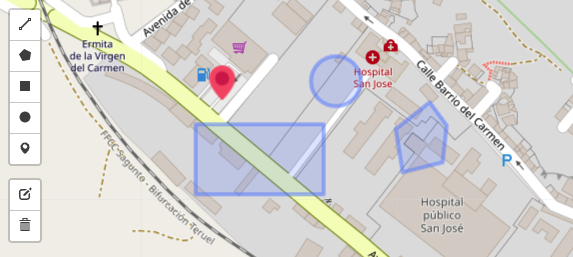

# React Leaflet Draft

> A modern study React component of leaflet draw for react-leaflet
> 


React component of [leaflet-draw](https://github.com/Leaflet/Leaflet.draw)
for [react-leaflet](https://github.com/PaulLeCam/react-leaflet)



## Table of contents

- [Main](#main)
- [Getting started](#getting-started)
- [API](#api)
- [License](#license)

## Main

```text
dist/
└── index.min.js    
```

## Getting started

### Requirements

```shell
yarn add leaflet leaflet-draw react-leaflet
```

### Installation

#### For React 17 with React Leaflet 3

```shell
yarn add react-leaflet-draft@ˆ1.2.1
```

#### For React 18 with React Leaflet 4

```shell
yarn add react-leaflet-draft@latest
```

### Usage

#### Basic Example

```jsx
<FeatureGroup>
    <DraftControl/>
</FeatureGroup>
```

#### Full Example

```jsx
import "leaflet/dist/leaflet.css";

import { DraftControl } from "react-leaflet-draft";
import { MapContainer, TileLayer, FeatureGroup } from "react-leaflet";

function Map() {
    return(
        <MapContainer
            zoom={14}
            center={[-22.2108112, -49.6771926]}
        >
            <TileLayer
                url="https://{s}.tile.openstreetmap.org/{z}/{x}/{y}.png"
            />
            <FeatureGroup>
                <DraftControl />
            </FeatureGroup>
        </MapContainer>
    )
}
```

## API

You can see the properties in [Leaflet-draw Documentation](http://leaflet.github.io/Leaflet.draw/docs/leaflet-draw-latest.html)

#### Example options

```jsx
<DraftControl
    draw={{
        circle: true,
        rectangle: true
    }}
    edit={{
        edit: {}
    }}
    translate={{
        toolbar: {
            buttons: {
                circle: 'Circle'
            }
        }
    }}
    limitLayers={2}
/>
```

#### Example listeners

```jsx
<DraftControl
    onEdited={e => console.log(e)}
    onDeleted={e => console.log(e)}
    onCreated={e => console.log(e)}
/>
```

## License
[ISC](https://opensource.org/licenses/ISC) © [Giovane Santos](https://giovanesantossilva.github.io/)
